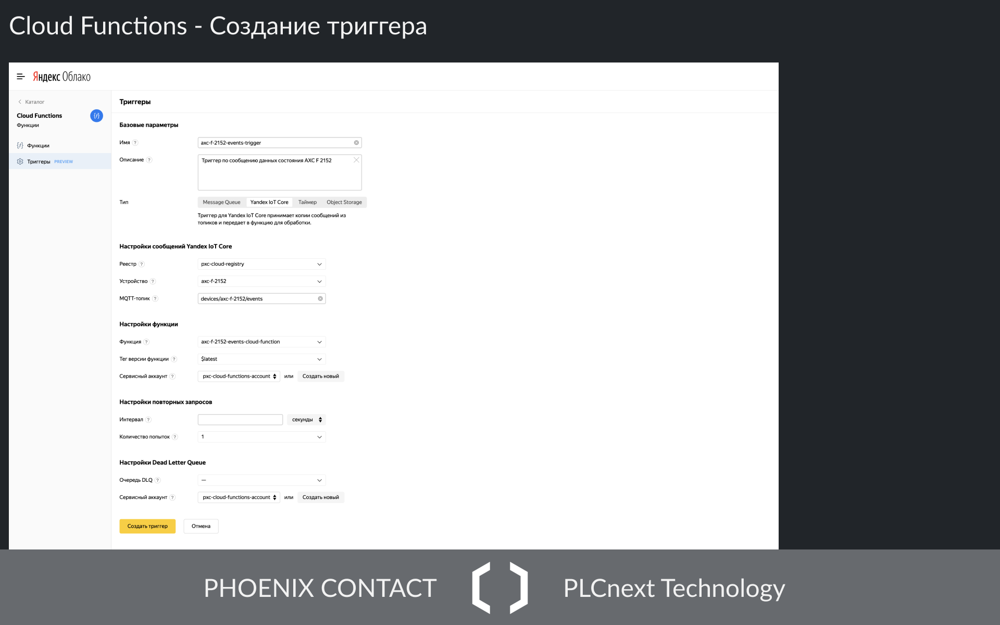

# Пример использования Yandex IoT Core

## Обзор
Пример использования сервисов [Яндекс Облако](https://cloud.yandex.ru) для принятия, хранения, 
и отображения данных от контроллеров для контроллеров на базе [PLCnext Technology](https://www.phoenixcontact.com/plcnext/).


## MQTT коннектор
Для отправки данных в MQTT брокер можно использовать [приложение на Node.js](https://github.com/axhelp/mqtt-client-dataserver) 
со следующими настройками:

Подробнее в [документации](https://cloud.yandex.ru/docs/iot-core/concepts/mqtt-properties)

Также можно использовать [C++ MQTT Сlient](https://github.com/PLCnext/MqttGdsConnector) (требуется компиляция).

Для генерации сертификатов устройства и реестра можно использовать [бинарные сборки OpenSSL](https://wiki.openssl.org/index.php/Binaries).

```bash
openssl req -x509 \
-newkey rsa:4096 \
-keyout axc-f-2152-key.pem \
-out axc-f-2152-cert.pem \
-nodes \
-days 365 \
-subj '/CN=localhost'

openssl req -x509 \
-newkey rsa:4096 \
-keyout registry-key.pem \
-out registry-cert.pem \
-nodes \
-days 365 \
-subj '/CN=localhost'
```
Подробнее в [документации](https://cloud.yandex.ru/docs/iot-core/operations/certificates/create-certificates).

## IoT Core

### Создание реестра устройств


### Добавление сертификата реестра


### Создание устройства


### Топики и алиасы топиков
Для каждого устройства выделено два топика:
-  `$devices/<device id>/events` — топик для отправки телеметрических данных
-  `$devices/<device id>/commands` — топик для получения команд

При этом есть возможность создать алиасы для этих топиков, например:
-   `devices/axc-f-2152/events`
-   `devices/axc-f-2152/commands`


Подробнее в [документации](https://cloud.yandex.ru/docs/iot-core/concepts/topic)

## Managed Service for Clickhouse

### Создание кластера


### Подключение из интерфейса


### Создание таблицы


```sql
CREATE TABLE pxc_cloud_db.timeseries_example
(
    dt Date,
    ts DateTime,
    topic String,
    value Float32 CODEC(Delta, ZSTD)
)
ENGINE = MergeTree
PARTITION BY dt
ORDER BY (topic, ts)
```

## Cloud functions

### Создание функции
Функция будет получать сообщения из MQTT брокера и записывать данные из них в таблицу Clickhouse.


### Загрузка Загрузка ZIP архива с кодом
Архив `axc-f-2152-events-cloud-function.zip` должен содержать:
-  [index.js](cloud-functions/axc-f-2152-events-cloud-function/index.js)
-  [YandexInternalRootCA.crt](https://storage.yandexcloud.net/cloud-certs/CA.pem)

### Создание триггера
Триггер будет вызывать функцию, передавая в нее два аргумента:
-  [event](https://cloud.yandex.ru/docs/functions/concepts/trigger/iot-core-trigger) — событие, содержащее сообщения от 
устройства
-  [context](https://cloud.yandex.ru/docs/functions/operations/function-sa) - контекст, 
содержащий токен для авторизации


Подробнее в [документации](https://cloud.yandex.ru/docs/functions/quickstart/iot-core-trigger-quickstart).

## Проверка записей в таблице


## Datalens

### Создание подключения


### Создание датасета


### Создание чарта


### Создание дашборда


### Просмотр дашборда

